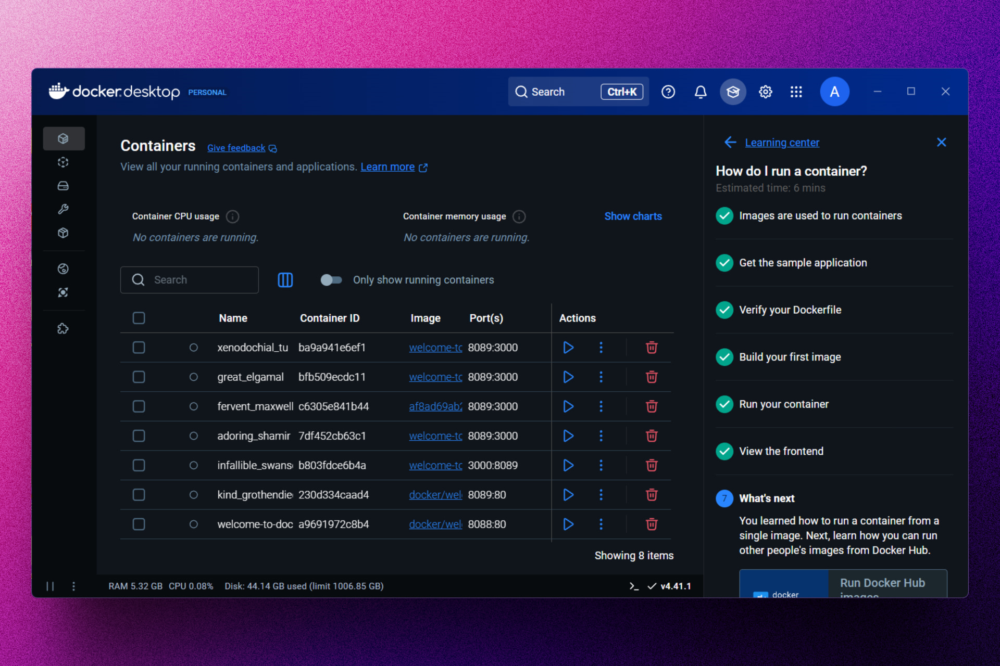
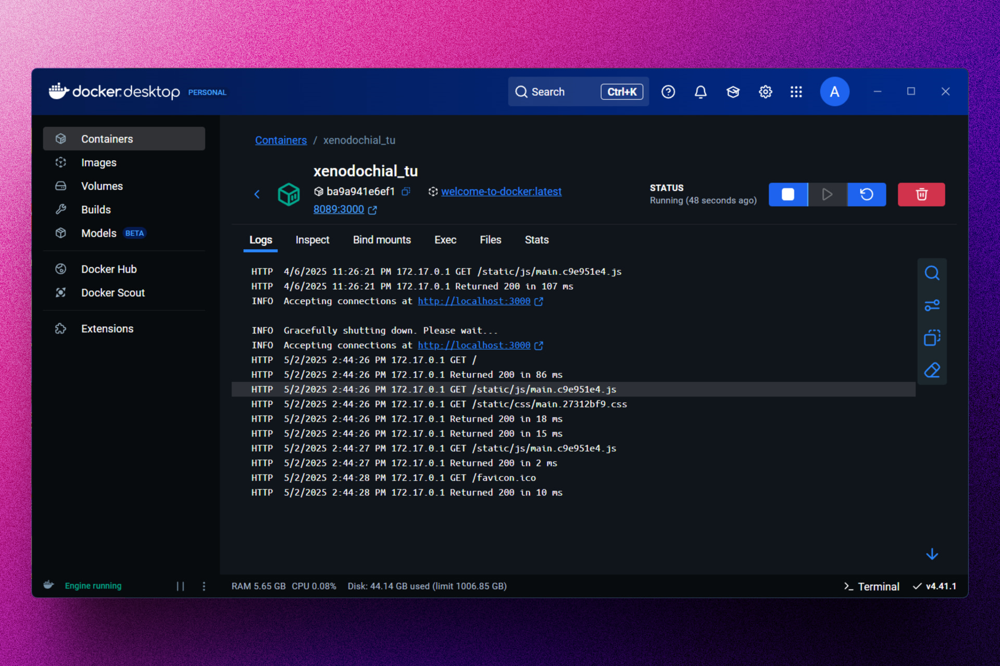

# 🐋 Docker: Learning Center Docker

### Repositorio con los proyectos de la ruta de aprendizaje de Docker Desktop.

## 🚀 Descripción

Este proyecto contiene los repositorios con los proyectos de la ruta de aprendizaje de Docker Desktop.

Con el propósito de aprender a utilizar esta herramienta he tomado el curso que ellos recomiendan para comenzar.

## 🎭 Tecnologías

- [**Docker**](https://www.docker.com/) Para construir y ejecutar los proyectos.
- [**Docker Desktop**](https://www.docker.com/products/docker-desktop/) Herramienta necesaria para ejecutar Docker Engine en ambiente de escritorio.
- [**Docker Hub**](https://hub.docker.com/) Para buscar los contenedores que se van a utilizar.